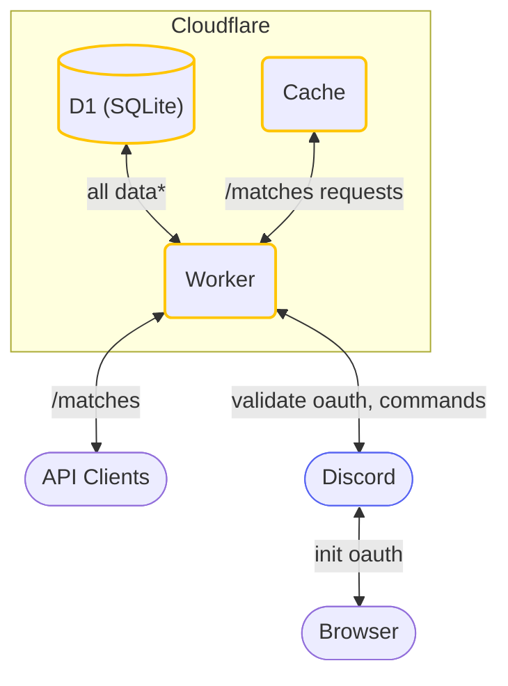

# Dota 2 Team Matches API

A simple API that fetches, caches and formats the
current [upcoming match schedule from Liquipedia](https://liquipedia.net/dota2/Liquipedia:Upcoming_and_ongoing_matches).

It caches matches for 3 hours after initially fetching them.

Big thanks to [Liquipedia](https://liquipedia.net) for providing the data! It is an amazing website ran and maintained
by amazing people.

## API

**Base URL:** `https://dota-matches-api.beequeue.workers.dev`

```ts
type Team = {
  name: string | null
  url: string | null
}

type Match = {
  hash: string
  teams: [Team | null, Team | null]
  matchType: string | null
  startsAt: string | null
  leagueName: string | null
  leagueUrl: string | null
  streamUrl: string | null
}
```

### `GET /v1/matches`

```ts
type ResponseBody = Match[]
```

## Development

### Setup

1. Install dependencies <br/>`pnpm install`
1. Start development server <br/>`pnpm dev`
1. Go wild!

### Architecture



\*Matches,
